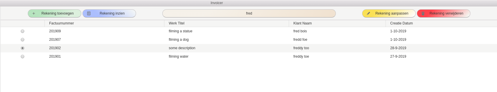
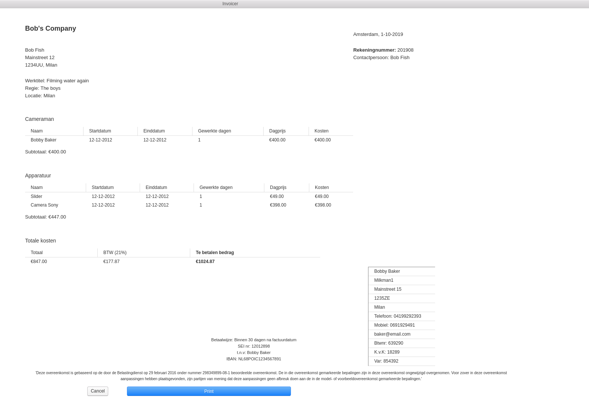

#### Invoicer helps you to create and manage your invoices.

A tool for (dutch) cameramen to create invoices and manage their invoices without needing excel or some other program.

Written with the following technologies:
- Electron, SQLite3, TypeScript, Mocha 

---

Overview of all created invoices.
Add new ones, view the selected invoice or filter through them.

---

Subsection of the create-invoice page.
Get visual feedback while typing. Know when, for example, an entered emailaddress is invalid.

---

View of a created invoice.
Press the print button to print the invoice to pdf.
