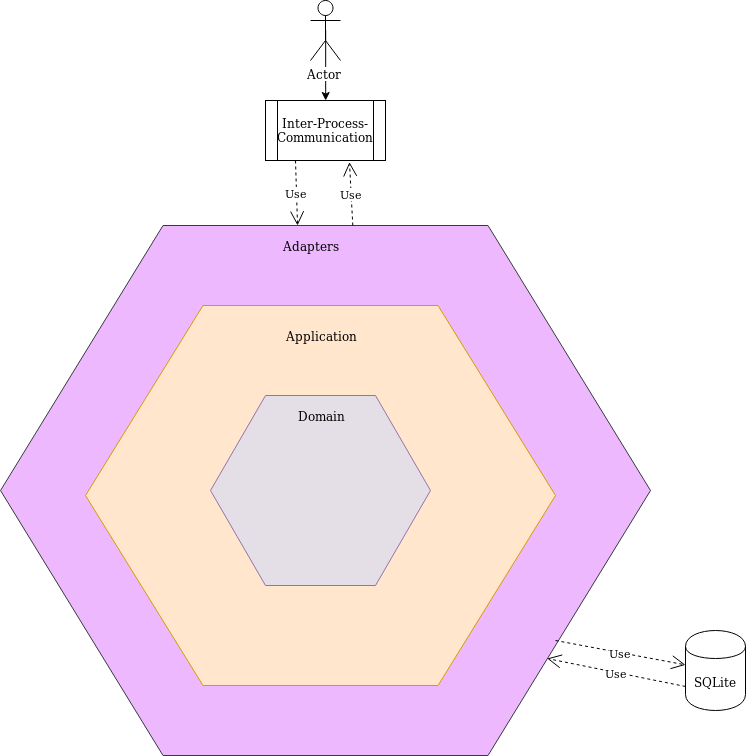
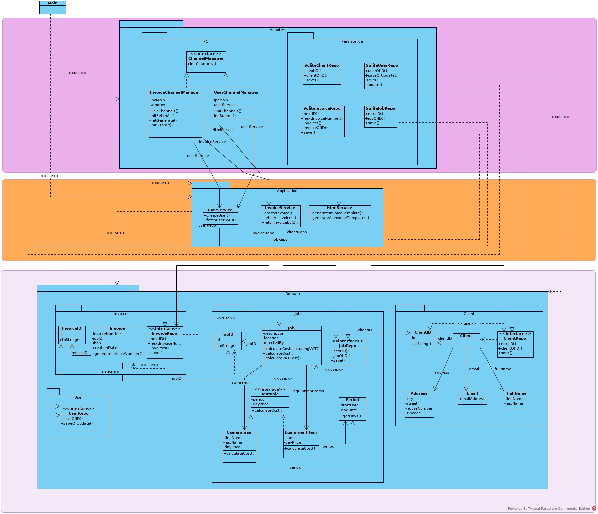

#### Invoicer helps you to create and manage your invoices.

A tool for (dutch) cameramen to create and manage invoices without needing excel or some other program.

Written with the **MEST** 🐮 stack:
- **M**ocha, **E**lectron, **S**QLite3, **T**ypeScript 

---

Overview of all created invoices.
Add new ones, view the selected invoice or filter through them.

---

Subsection of the create-invoice page.
Get visual feedback while typing. Know when, for example, an entered emailaddress is invalid.

---

View of a created invoice.
Press the print button to print the invoice to pdf.

---
#### Documentation

The project has a hexagonal architecture:

The adapter hexagon contains classes that transform incoming data to a format
that is understood by the application. At the moment there are only adapter classes
for the Inter-Process-Communication (IPC) port, but new ones could be added if needed
in the future. For example if a decision is made to also expose our app via REST.

The application hexagon contains the services the application provides.

The domain hexagon contains all domain classes and business-rules.

##### Class diagram
Parameters, constructors, getters, setters and types have been left out, as they clutter the diagram.

